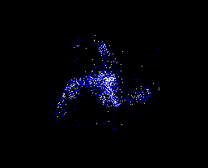
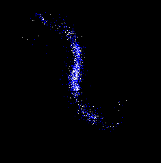

# little dark galaxy
Little dark galaxy is a simple spiral galaxy generator written in C++/SDL. 
This is definetly not an accurate model of physics, it's just for fun. Normal 
matter is rendered as white dots while dark matter is rendered as blue dots. 
The difference between the two types of matter is that normal matter has friction
(to model energy loss due to interactions with the electromagnetic field) while 
dark matter has no friction. 

By spawning the particles in a small circle with random velocities but with high
angular velocities we see the ocurrence of "spiral galaxies". 2 Arms galaxies are the
most common, but sometimes 3 arms are generated.

 

 
